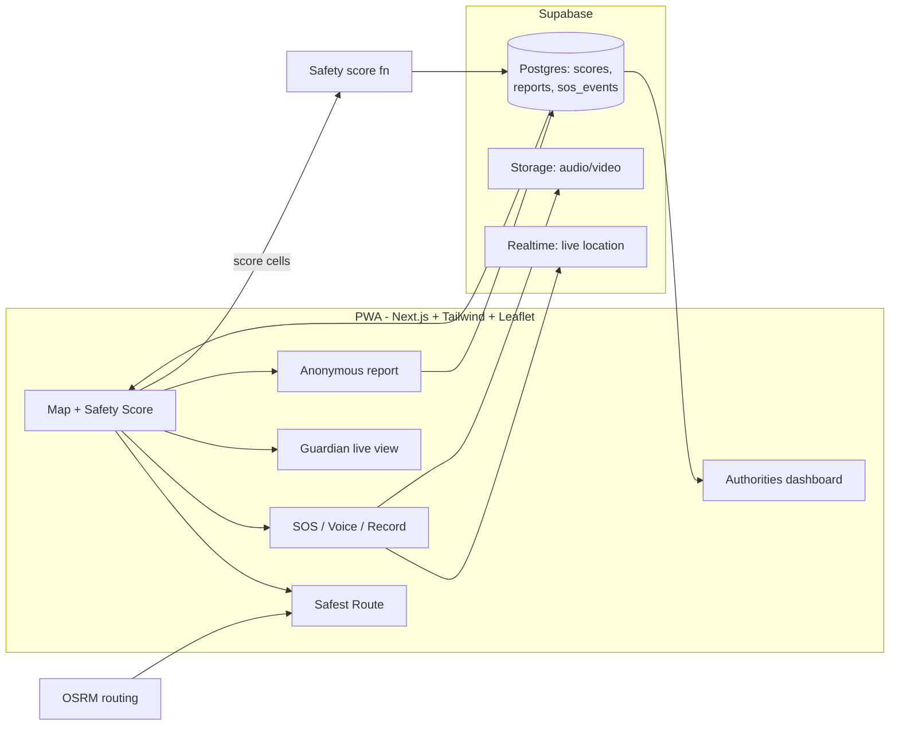

# HerGuardian — Implementation Plan

**One-liner:** HerGuardian gives women a *predictive* safety layer: it scores where you are, routes you the safest way (not the shortest), and only then does the emergency stuff — SOS, live share, recording — with every user report feeding back into the score.

Assumptions: 24–48h hackathon, team of 2–4, mobile-first PWA, fake/seeded data is fine (marked `// FAKE`).

---

## 1. Proposed solution

A **PWA + Supabase backend** with five features in one closed loop:

| Loop stage | Feature | How (lazy version) |
|---|---|---|
| **Predict** | Real-time Safety Score per location | Weighted heuristic over: crime history (seeded NCRB/public data), user reports (recency-decayed), time-of-day, lighting, crowd proxy (POI density). One function, documented weights — no ML training at the hackathon |
| **Prevent** | Safest-route recommendation | Fetch N candidate routes (OSRM), score each by aggregating cell-safety along its geometry, recommend lowest-risk; show shortest vs safest side-by-side |
| **Respond** | One-tap SOS, live location, voice trigger, auto-record, Guardian Mode | All browser-native: `tel:`/`sms:` links + Web Share, Geolocation + Supabase Realtime for guardian tracking, Web Speech API ("help me") for voice, MediaRecorder → Supabase Storage |
| **Improve** | Anonymous incident reports | One form (type + location + optional photo), no login; recency-weighted into the score |
| **Govern** | Authorities analytics dashboard | Aggregate heatmaps + hotspot trend charts from the same tables, role-gated page |

### Why this solution
1. **Reactive → predictive.** Every incumbent app is a panic button; the actual gap is *before* the incident.
2. **Browser-native = 5 features for ~free.** Voice, GPS, recording, share, push all exist in the PWA platform — no native build, demoable from a URL instantly on any judge's phone.
3. **The score is the moat and it's a loop.** Reports improve the score → better routes → users trust reports → more reports. Competitors have data silos, not loops.
4. **One dataset serves users and authorities.** The heatmap judges see is the same table the routing reads — no second system to build.
5. **Honest MVP.** A documented weighted heuristic beats an untrained "AI" — judges ask "how does your model work?" and a transparent scoring formula answers better than fake ML. ML upgrade path stays open (features are already extracted).

### Architecture

### Stack (boring, per handbook)
- **Next.js (TS) + Tailwind + shadcn/ui + MapLibre/Leaflet** — PWA, one codebase
- **Supabase** — Postgres, Auth (magic link), Realtime (guardian tracking), Storage (recordings). No custom WebSocket server.
- **OSRM** — public demo server first, self-hosted Docker profile if time allows
- **AGENTS.md rules file** — pitch, stack, look, "no new libraries without asking", "fake data marked // FAKE"

### Data model (5 tables)
`safety_cells` (grid id, lat/lng, base_score, lighting, crowd_proxy) · `reports` (type, geo, anon, created_at) · `incidents` (seeded crime history) · `guardian_sessions` (user, guardian, poly, expires) · `sos_events` (geo, media_url, status)

---

## 2. Implementation phases (48h)

| Phase | When | Deliverable |
|---|---|---|
| **0. Skeleton** | Hour 0–1 | Pitch, core flow (3–5 steps), AGENTS.md, agreed diagram, repo + deploy pipeline |
| **1. Core loop** | Hour 1–8 | Map, seeded safety grid + score function, route scoring (shortest vs safest comparison screen) ← **the demo flow** |
| **2. Emergency** | Hour 8–16 | One-tap SOS, live share + Guardian Mode via Realtime |
| **3. Smart extras** | Hour 16–24 | Voice trigger, auto audio/video record → Storage, anonymous report form feeding the score |
| **4. Authorities** | Hour 24–32 | Hotspot heatmap, trend charts, seeded "before/after" story |
| **5. Polish** | Hour 32–45 | Impeccable critique, mobile-first fixes, seeded demo data, rehearse ×2 |
| **Freeze** | Last 3h | Bug fixes only, deploy live, backup video |

**Team split (4):** frontend-map · backend/Supabase · scoring+data seed · dashboard+pitch. One agent session per person, one branch each, commit after every working step.

**Cut list (don't build):** ML training, native app, real SMS provider (use `tel:`/`sms:` links), full auth (magic link only), background SOS when tab closed (state the PWA limitation honestly).

---

## 3. Comparison with existing solutions

| Existing | What it does | Where it stops |
|---|---|---|
| **Citizen / Noonlight** (US) | Reactive incident alerts, panic button monitoring | Reports crime *after* it happens; no score, no routing |
| **bSafe** | Panic button, Follow-Me GPS share, some route features | Static; no predictive scoring from crime/lighting/crowd data |
| **My Safetipin** (India) | Safety audit scores per location — *closest to us* | Scores are **static audit snapshots**; no real-time time-of-day/crowd signal, no emergency response suite, no authority dashboard |
| **Himmat app** (Delhi Police) | SOS + GPS alerts | Mostly defunct, government-siloed, no intelligence layer |
| **Life360** | Family tracking | Tracking only; no risk prediction at all |
| **SafeCity / Guardium** | Institutional harassment/crime analytics | Built *for authorities only*; citizens get nothing |

**Why build this instead:**
1. **Nobody closes the loop.** Citizen=because-it-happened, bSafe=when-it's-happening, Safetipin=what-audit-said-last-year, SafeCity=what-authorities-see. HerGuardian is the only one where *predict → prevent → respond → improve → govern* share one data pipeline.
2. **Dynamic vs static score.** Our score changes with time of day, fresh reports, lighting and crowd — Safetipin's is a survey result that goes stale.
3. **Safest route ≠ shortest route.** Route-risk comparison is the visible "aha" for judges; most incumbents don't do it or do it statically.
4. **Citizens feed authorities and vice versa** — anonymous reports crowd-source the model while the dashboard justifies infrastructure spend, a two-sided value prop no consumer app has.
5. **It's buildable in 48h.** The differentiation is the scoring loop and routing UX, not infrastructure — hence PWA + Supabase instead of a native app we couldn't finish.

**Honest risk:** data availability (lighting/crowd aren't in OSM) — mitigate with public crime datasets (NCRB/data.gov.in, Kaggle) + POI-density proxy + seeded cells. Judges care that the *pipeline* is real and the weights are defensible.
