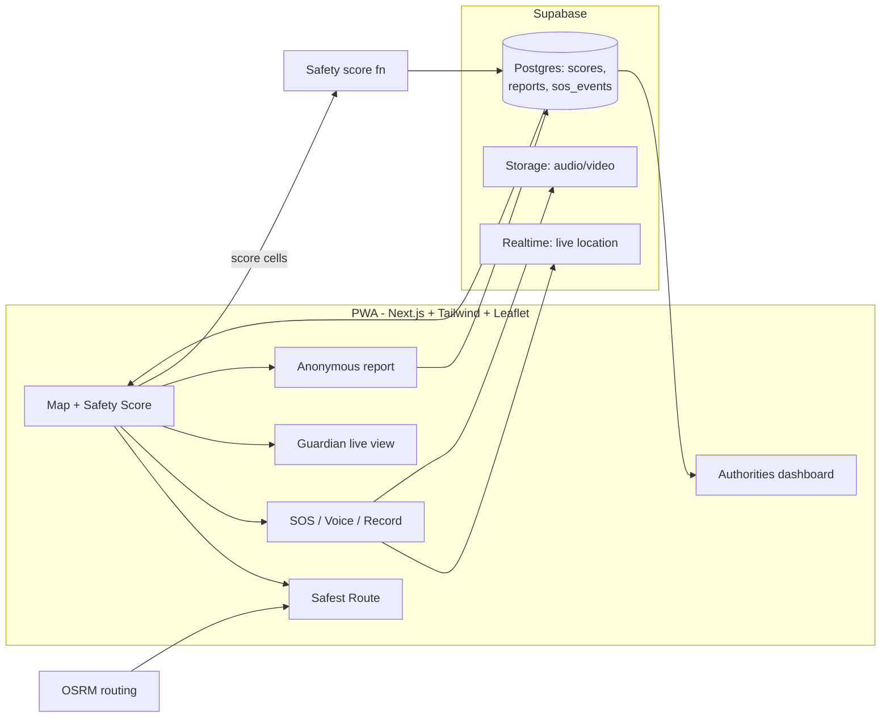

# HerGuardian — Implementation Plan

**One-liner:** HerGuardian gives women a *predictive* safety layer: it scores where you are, routes you the safest way (not the shortest), and only then does the emergency stuff — SOS, live share, recording — with every user report feeding back into the score.

Assumptions: 36h hackathon, team of 4, mobile-first PWA, fake/seeded data is fine (marked `// FAKE`).

---

## 1. Proposed solution

A **PWA + Supabase backend** with five features in one closed loop:

| Loop stage | Feature | How (lazy version) |
|---|---|---|
| **Predict** | Real-time Safety Score per location | Weighted heuristic over: crime history (seeded NCRB/public data), user reports (recency-decayed), time-of-day, lighting, crowd proxy (POI density). One function, documented weights — no ML training at the hackathon |
| **Prevent** | Safest-route recommendation | Fetch N candidate routes (OSRM), score each by aggregating cell-safety along its geometry, recommend lowest-risk; show shortest vs safest side-by-side |
| **Respond** | One-tap SOS, live location, voice trigger, auto-record, Guardian Mode | All browser-native: `tel:`/`sms:` links + Web Share, Geolocation + Supabase Realtime for guardian tracking, Web Speech API ("help me") for voice, MediaRecorder → Supabase Storage |
| **Improve** | Anonymous incident reports | One form (type + location + optional photo), no login; recency-weighted into the score |
| **Govern** | Authorities analytics dashboard | Aggregate heatmaps + hotspot trend charts from the same tables, role-gated page |

### Why this solution
1. **Reactive → predictive.** Every incumbent app is a panic button; the actual gap is *before* the incident.
2. **Browser-native = 5 features for ~free.** Voice, GPS, recording, share, push all exist in the PWA platform — no native build, demoable from a URL instantly on any judge's phone.
3. **The score is the moat and it's a loop.** Reports improve the score → better routes → users trust reports → more reports. Competitors have data silos, not loops.
4. **One dataset serves users and authorities.** The heatmap judges see is the same table the routing reads — no second system to build.
5. **Honest MVP.** A documented weighted heuristic beats an untrained "AI" — judges ask "how does your model work?" and a transparent scoring formula answers better than fake ML. ML upgrade path stays open (features are already extracted).

### Architecture

### Stack (boring, per handbook)
- **Next.js (TS) + Tailwind + shadcn/ui + MapLibre/Leaflet** — PWA, one codebase
- **Supabase** — Postgres, Auth (magic link), Realtime (guardian tracking), Storage (recordings). No custom WebSocket server.
- **OSRM** — public demo server first, self-hosted Docker profile if time allows
- **AGENTS.md rules file** — pitch, stack, look, "no new libraries without asking", "fake data marked // FAKE"

### Data model (4 tables — supabase/schema.sql is authoritative)

`safety_cells` (grid lat/lng + crime/report/lighting/crowd factors, `report_bumped_at` for read-time 7-day decay) · `reports` (anonymous, `seeded` flag, no public read) · `incidents` (seeded history with `source` provenance) · `guardian_sessions` (SOS session = status + latest pin + `media_paths[]`; uuid is the capability — no auth in MVP). Private storage buckets `recordings`, `report-photos` (service-role only, signed URLs out). RLS: public read cells/incidents, anon insert reports/sessions, reports never publicly readable. Score stays in TS (`src/lib/safety.ts`); DB stores factors only — no PostGIS, no triggers (report→cell bump happens in `/api/report`).

---

## 2. Implementation phases (overview — detailed checklist in §4)

> §4 is the authoritative timeline. This table is the summary.

| Phase | When | Deliverable |
|---|---|---|
| **0. Skeleton** | Hour 0–1 | Pitch, core flow (3–5 steps), AGENTS.md, agreed diagram, repo + deploy pipeline |
| **1. Core loop** | Hour 1–8 | Map, seeded safety grid + score function, route scoring (shortest vs safest comparison screen) ← **the demo flow** |
| **2. Emergency** | Hour 8–16 | One-tap SOS, live share + Guardian Mode via Realtime, voice, auto-record |
| **3. Reports + Authorities** | Hour 16–24 | Anonymous report form feeding the score, hotspot heatmap, trend charts |
| **4. Polish** | Hour 24–31 | Impeccable critique, mobile-first fixes, seeded demo data, rehearse ×2 |
| **5. Freeze** | Hour 31–36 | Bug fixes only, deploy live, backup video |

**Team split (4):** frontend-map · backend/Supabase · scoring+data seed · dashboard+pitch. One agent session per person, one branch each, commit after every working step.

**Cut list (don't build):** ML training, native app, real SMS provider (use `tel:`/`sms:` links), full auth (magic link only), background SOS when tab closed (state the PWA limitation honestly).

---

## 3. Comparison with existing solutions

| Existing | What it does | Where it stops |
|---|---|---|
| **Citizen / Noonlight** (US) | Reactive incident alerts, panic button monitoring | Reports crime *after* it happens; no score, no routing |
| **bSafe** | Panic button, Follow-Me GPS share, some route features | Static; no predictive scoring from crime/lighting/crowd data |
| **My Safetipin** (India) | Safety audit scores per location — *closest to us* | Scores are **static audit snapshots**; no real-time time-of-day/crowd signal, no emergency response suite, no authority dashboard |
| **Himmat app** (Delhi Police) | SOS + GPS alerts | Mostly defunct, government-siloed, no intelligence layer |
| **Life360** | Family tracking | Tracking only; no risk prediction at all |
| **SafeCity / Guardium** | Institutional harassment/crime analytics | Built *for authorities only*; citizens get nothing |

**Why build this instead:**
1. **Nobody closes the loop.** Citizen=because-it-happened, bSafe=when-it's-happening, Safetipin=what-audit-said-last-year, SafeCity=what-authorities-see. HerGuardian is the only one where *predict → prevent → respond → improve → govern* share one data pipeline.
2. **Dynamic vs static score.** Our score changes with time of day, fresh reports, lighting and crowd — Safetipin's is a survey result that goes stale.
3. **Safest route ≠ shortest route.** Route-risk comparison is the visible "aha" for judges; most incumbents don't do it or do it statically.
4. **Citizens feed authorities and vice versa** — anonymous reports crowd-source the model while the dashboard justifies infrastructure spend, a two-sided value prop no consumer app has.
5. **It's buildable in 36h.** The differentiation is the scoring loop and routing UX, not infrastructure — hence PWA + Supabase instead of a native app we couldn't finish.

**Honest risk:** data availability (lighting/crowd aren't in OSM) — mitigate with public crime datasets (NCRB/data.gov.in, Kaggle) + POI-density proxy + seeded cells. Judges care that the *pipeline* is real and the weights are defensible.

---

## 4. Phased task plan (36h, 4 people) — authoritative timeline

**Roles (one agent session + one branch each):**
- **A — Frontend/Map:** PWA screens, Leaflet, UI
- **B — Backend:** Supabase schema, auth, Realtime, Storage, API routes
- **C — Scoring/Routing:** safety score fn, OSRM integration, seed data
- **D — Emergency UX + Dashboard + Pitch:** SOS/voice/record, authorities page, demo script

**Standing rules (from handbook):** fresh agent session per feature · one file = one owner · commit after every working step · merge to `main` often · fake data marked `// FAKE`.

### Phase 0 — Skeleton (h0–1) · everyone
| # | Task | Owner | Done when |
|---|---|---|---|
| 0.1 | Agree one-sentence pitch + 3–5 step core flow | all | written in AGENTS.md |
| 0.2 | Scaffold Next.js + Tailwind + shadcn, PWA manifest | A | `npm run dev` renders shell |
| 0.3 | Create Supabase project, wire env, magic-link auth | B | login works locally |
| 0.4 | Vercel deploy pipeline + `dev`/`main` branches | B | live URL returns 200 |
| 0.5 | Seed script stub + demo city chosen | C | `npm run seed` runs |

**Exit check:** app deployed at live URL, everyone on their branch. **Commit:** "phase 0 skeleton deployed".

### Phase 1 — Core loop (h1–8) ← *the demo flow*
| # | Task | Owner | Done when |
|---|---|---|---|
| 1.1 | Tables: `safety_cells`, `incidents`, `reports` + seed ~500 cells | B+C | rows visible in Supabase |
| 1.2 | Safety score function (weights: crime 40 / reports 25 / time 15 / lighting 10 / crowd 10) + `/api/score` | C | returns 0–100 for a lat/lng |
| 1.3 | Map screen: geolocate, heatmap layer colored by score | A | colors render on phone |
| 1.4 | OSRM fetch of 3 candidate routes + segment score aggregation | C | each route gets a risk score |
| 1.5 | Shortest-vs-safest comparison screen, safest highlighted | A | pick destination → 2 routes, scores shown |
| 1.6 | Demo script draft (pitch template) | D | 2-min script exists |

**Exit check:** *open app → colored map → enter destination → safest route wins* on a real phone. **Commit + deploy:** "core loop demoable".

### Phase 2 — Emergency (h8–16)
| # | Task | Owner | Done when |
|---|---|---|---|
| 2.1 | `guardian_sessions` + Realtime channel for live pins | B | two browsers share a channel |
| 2.2 | One-tap SOS flow: confirm → `sms:`/`tel:` links + guardian URL | A | SMS link opens guardian view |
| 2.3 | Guardian live-tracking page (pin follows in real time) | A | pin moves phone A → phone B |
| 2.4 | Voice trigger via Web Speech API ("help me" → SOS) | D | phrase fires SOS |
| 2.5 | Auto audio/video record → Supabase Storage | D | file appears in Storage |

**Exit check:** phone A taps SOS → phone B sees live pin + recording uploads. **Commit per feature.**

### Phase 3 — Reports + Authorities (h16–24)
| # | Task | Owner | Done when |
|---|---|---|---|
| 3.1 | Anonymous report form (type, geo, photo, no login) + anon RLS insert | A+B | report inserts without auth |
| 3.2 | Reports → score pipeline (recency decay λ≈7d) | C | submitting a report changes nearby score |
| 3.3 | Dashboard: hotspot heatmap + top-10 risky cells | D | dashboard reads live tables |
| 3.4 | Trend chart (reports/week) + "before/after" seeded story | D | chart renders with seeded data |

**Exit check:** submit report → score changes → dashboard hotspot moves. **Commit:** "closed loop".

### Phase 4 — Polish (h24–31)
- A: Impeccable critique + mobile-first fixes on the 3 main screens
- C: reseed demo data so the demo *always* looks good
- D: rehearse pitch ×2, record backup video (Brag plugin)
- B: verify `.env` not in git, RLS policies, dead-end/error states
- All: every diff reviewed

**Exit check:** demo runs clean twice from the live URL. **Commit:** "demo ready".

### Phase 5 — Freeze (h31–36)
- Bug fixes only, no features · final deploy · `git status` clean · backup video saved · screenshots for the channel

---

**Critical path:** 1.2 → 1.4 → 1.5 (C then A) — everything else parallelizes.
**Cut order if behind:** 3.4 chart → voice (2.4) → auto-record (2.5) → magic-link auth. Never cut: core loop + SOS.
